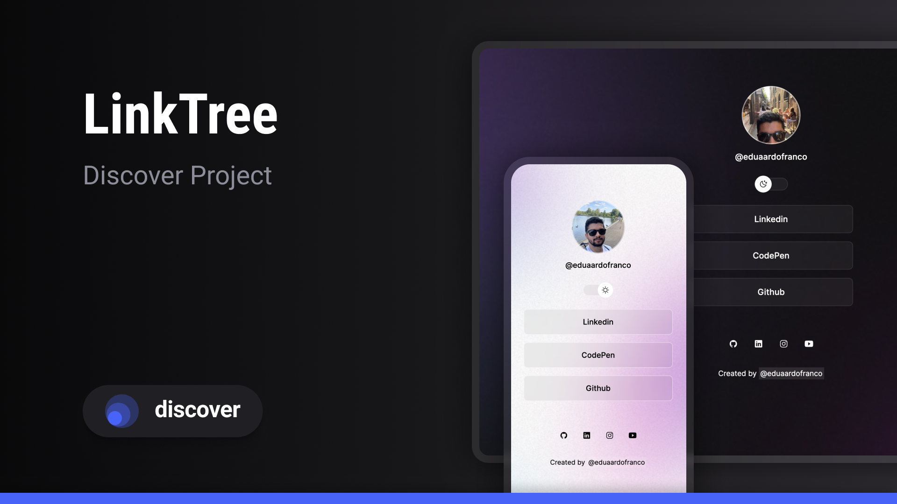

<h1 align="center"> LinkTree</h1>

This project was created as part of studies from Rockseat dev school.

  <a href="#-tecnologias">Stack</a>&nbsp;&nbsp;&nbsp;|&nbsp;&nbsp;&nbsp;
  <a href="#-projeto">Project</a>&nbsp;&nbsp;&nbsp;|&nbsp;&nbsp;&nbsp;
  <a href="#-layout">Layout</a>&nbsp;&nbsp;&nbsp;|&nbsp;&nbsp;&nbsp;
  <a href="#memo-licença">Licence</a>

  

 

  

## 🚀 Stack

This project was created using:

- HTML and CSS
- JavaScript
- Git and Github
- Figma

## 💻 Project

 LinkTree is a link aggregator which you can have all your social link in one place.

## 🔖 Layout

You can view the project layout through [THIS LINK](https://www.figma.com/file/J1Z33MISC22YZB8wfxiIns/NLW-Copa-Explorer/duplicate). You need to have an account [Figma](https://figma.com) to acess it.

## :memo: Licence

This project is under MIT licence.